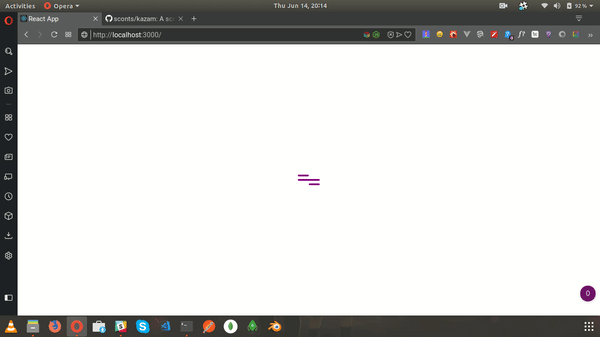

### Hamburger Animation

#### Animation:



#### Usage Plain CSS:
- Add `index.css` to use the animation
- Create a container `<div></div>`
- Put 3 `<div></div>`'s inside
- Assign class `hamburger-top`, `hamburger-center` and `hamburger-bottom` to the inner `div`'s
- Add style `position: relative` to the container `div` create the Hamburger Icon
- Add class `active` to animate it once. Remove the class to revert position
- Add class `loading` to animate it infinitely. Remove the class to revert position

#### Usage React:
- import `Hamburger` component into your file
- Add prop `active` to make the hamburger active
- Add prop `loading` to make hamburger a loader

> Check `App.js` for usage example


#### Examples Plain CSS:
##### Display `Hamburger Icon`
```html
  <div style="position: relative">
    <div class="hamburger-top"></div>
    <div class="hamburger-center"></div>
    <div class="hamburger-bottom"></div>
  </div>
```

##### Active `Hamburger Icon`
```html
  <div style="position: relative">
    <div class="hamburger-top active"></div>
    <div class="hamburger-center active"></div>
    <div class="hamburger-bottom active"></div>
  </div>
```

##### Infinite Loading `Hamburger Icon`
```html
  <div style="position: relative">
    <div class="hamburger-top loading"></div>
    <div class="hamburger-center loading"></div>
    <div class="hamburger-bottom loading"></div>
  </div>
```

#### Examples React:
##### Display `Hamburger Icon`
```js
  import Hamburger from './src/components/Hamburger';
  ...
  class ... extends Component {
    ...
    render() {
      ...
      return (
        ...
        <Hamburger />
        ...
      )
    }
  }
```

##### Active `Hamburger Icon`
```js
  import Hamburger from './src/components/Hamburger';
  ...
  class ... extends Component {
    ...
    render() {
      ...
      return (
        ...
        <Hamburger active />
        ...
      )
    }
  }
```

##### Infinite Loading `Hamburger Icon`
```js
  import Hamburger from './src/components/Hamburger';
  ...
  class ... extends Component {
    ...
    render() {
      ...
      return (
        ...
        <Hamburger loading />
        ...
      )
    }
  }
```